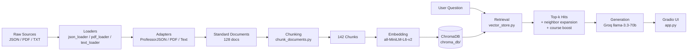

# Project 1 Planning: The Unofficial Guide

> Write this document before you write any pipeline code.
> Your spec and architecture diagram are what you'll use to direct AI tools (Claude, Copilot, etc.) to generate your implementation — the more specific they are, the more useful the generated code will be.
> Update the Retrieval Approach and Chunking Strategy sections if you change your approach during implementation.
> Update this file before starting any stretch features.

---

## Domain

The domain of this project is the USF Computer Science Survival Guide (Unofficial Student Knowledge System). It focuses on student-generated and experience-based information about computer science courses, professors, and academic planning at the University of South Florida.

This knowledge is valuable because it helps students make informed decisions about course selection, professor difficulty, and degree planning based on real student experiences rather than official course descriptions. It is difficult to find through official channels because university catalogs and departmental websites only provide formal information such as prerequisites and course objectives, while omitting practical insights like teaching style, workload difficulty, grading patterns, and student experiences.

---

## Documents

| # | Source | Description | URL or location |
|---|--------|-------------|------------------|
| 1 | USF CS Professors Dataset (JSON file) | Rate My Professors export for 20 USF CS faculty: aggregate quality and difficulty scores, would-take-again rates, rating distributions, and full student review text tied to specific courses (e.g., CDA3201), plus tags like "Amazing lectures" and "Tough grader" | `documents/dataset_rate-my-professors.json` |
| 2 | Official USF CS program information | USF's authoritative BS in Computer Science page covering admission requirements, degree objectives, core curriculum structure, and formal course expectations—useful as a baseline against which student experiences can be compared | `documents/usf_bscs_page.txt` — https://www.usf.edu/ai-cybersecurity-computing/academics/undergraduate/bscs.aspx |
| 3 | COP3514 Programming Concepts (r/USF) | Thread on COP 3514 (program design) covering perceived difficulty, project workload, exam style, and professor-specific advice from students who have taken the course | `documents/reddit_cop3514.txt` — https://www.reddit.com/r/USF/comments/13ewl3y/program_design_cop_3514/ |
| 4 | COP2510 Difficulty | Thread focused on COP 2510 (introductory programming): how steep the learning curve feels, time commitment, common pitfalls for new CS students, and tips for succeeding in a first coding course | `documents/reddit_cop2510.txt` — https://www.reddit.com/r/USF/comments/yn7dtp/cop_2510_difficulty/ |
| 5 | USF CS Degree Flowchart | Visual degree plan showing prerequisite chains, recommended semester-by-semester course order, gen-ed slots, and elective windows—helps answer "what should I take next?" and "what unlocks what?" | `documents/usf_cs_plan.pdf` |
| 6 | r/USF CS Program Opinion Thread (Need Your Opinion) | Open-ended student opinions on the overall USF CS program: strengths and weaknesses, department culture, internship and career outcomes, and whether the degree feels worth the effort | `documents/reddit_program_opinion.txt` — https://www.reddit.com/r/USF/comments/1rroyo1/need_your_opinion/ |
| 7 | r/USF CS Course Load & Difficulty Discussion | Practical advice on juggling a job with CS coursework, with firsthand difficulty ratings for COP 2513 (programming II) and MAD 2104 (discrete math) and how those courses compare in weekly hours | `documents/reddit_course_load.txt` — https://www.reddit.com/r/USF/comments/7bu5tk/how_hard_are_these_classes_will_working_be_too/ |
| 8 | r/USF “Easiest CS Electives” Thread | Crowdsourced elective picks students consider low-stress, including which upper-level CS courses have lighter workloads, easier grading, or less prerequisite depth | `documents/reddit_easiest_electives.txt` — https://www.reddit.com/r/USF/comments/7k07b8/easiest_cs_electives/ |
| 9 | USF CS Student Study Guides Repository (GitHub) | Community-maintained repo of course-specific study guides, exam reviews, and reference sheets for core CS classes (data structures, discrete math, computer organization, and related topics)—student-authored supplements to lecture material | `documents/github_cse_resources.txt`, `documents/github_cop3514_exam1_review.txt` — https://github.com/aeckar/usf-cse-resources |
| 10 | USF Computer Science Program Student Experience Discussion (r/USF) | Long-form thread from current and alumni CS majors on day-to-day program life: professor quality, course rigor, languages and tools taught, research opportunities, and how well the curriculum prepared them for internships and jobs | `documents/reddit_cs_experience.txt` — https://www.reddit.com/r/USF/comments/s4ht3j/anyone_here_in_usf_computer_science_department/ |

---

## Chunking Strategy

**Chunk size:** 500 characters (only for documents longer than 800 characters)

**Overlap:** 75 characters

**Reasoning:** Most ingested documents are already small, self-contained units — one professor review, one PDF page, or one Reddit comment. Those stay whole (pass-through) so retrieval returns a complete review or comment, not a fragment. Documents over 800 characters (long Reddit threads, USF page, GitHub study guide) are split because all-MiniLM-L6-v2 truncates input around 256 tokens (~800 chars). Splitting at ~500 chars with 75-char overlap keeps each chunk within the embedder limit while preserving context across boundaries. Semantic chunking is not used — adapters already split at natural boundaries (review, page, comment).

**Preprocessing before chunking:** The `TextAdapter` splits Reddit `.txt` files into separate documents per `POST` / `COMMENT` section, sub-splits long comments at paragraph boundaries, and splits mixed-topic replies (e.g., COP 3514 vs CDA 3103) at topic shifts. The `ProfessorJSONAdapter` emits one document per review plus one summary per professor. The `PDFAdapter` emits one document per page. `BaseAdapter.build_document()` strips `None` values from metadata before storage.

**Final chunk count:** 142 chunks from 128 ingested documents.

---

## Retrieval Approach

**Embedding model:** `all-MiniLM-L6-v2` via `sentence-transformers`, wrapped in ChromaDB's `SentenceTransformerEmbeddingFunction`. Cosine similarity is used as the distance metric (`hnsw:space: cosine`).

**Top-k:** 4 chunks per query, expanded to up to 8 after neighbor expansion and course-code boosting.

**Retrieval enhancements beyond pure vector search:**
- **Neighbor expansion:** When a hit comes from a multi-chunk document, adjacent chunks from the same file are pulled in so answers split across chunk boundaries are not lost.
- **Course-code boosting:** If the query mentions a course code (e.g., `COP 3514`), the system also runs a filtered similarity search over chunks from matching source files (e.g., `reddit_cop3514.txt`), prioritizing Reddit threads over GitHub study guides and skipping original `POST`-only sections when student comments are available.

**Production tradeoff reflection:** For a real deployment with no cost constraint, I would evaluate models with longer context windows (e.g., `text-embedding-3-large` or domain-fine-tuned embeddings) to reduce reliance on aggressive chunking. Multilingual support is not critical for this corpus, but a model trained on technical/educational text might better match course codes and professor names. API-hosted embeddings would reduce local RAM use and cold-start time but add latency and per-query cost; local MiniLM is appropriate for a 142-chunk student project corpus.

---

## Evaluation Plan

| # | Question | Expected answer |
|---|----------|-----------------|
| 1 | How hard is COP 3514 according to students? | Students generally describe COP 3514 (Program Design) as manageable if you know C/C++ basics; comments mention it is not extremely tough, projects and pointers/linked lists matter, and you want at least a B. Difficulty varies by student background. |
| 2 | What do students say about Rangachar Kasturi? | Reviews are strongly positive: clear lectures, caring, one of the best CS professors, high quality ratings (~4.2 overall), tags like "Amazing lectures" and "Caring." |
| 3 | What are some of the easiest CS electives at USF? | Students mention Software Systems Development (easy A, simple assignments), Software Engineering (group project, mostly online), and Software Testing (no exams, easy assignments). |
| 4 | What is the workload like for COP 2510? | Intro programming course; students say effort matters more than prior experience, office hours help, Dr. Small teaches well, and a B is achievable with consistent work — not trivial but doable for beginners. |
| 5 | What do students think about the USF CS program overall? | Mixed opinions: some find it doable with heavy curving and reasonable grades; others criticize advisor quality, limited course variety, job market difficulty, and inconsistent professor quality. No single consensus. |

---

## Anticipated Challenges

1. **Chunk boundaries splitting answers from questions in long Reddit threads.** A thread's original post asks a question while student replies with the actual answer may land in later chunks. Pure embedding search often ranks the question post highly because it repeats the course name, leaving the LLM without enough context. Mitigation: split threads by comment during ingestion, expand neighboring chunks at retrieval time, and boost chunks from course-named source files.

2. **Off-target retrieval across similar courses.** Queries about COP 3514 may retrieve COP 2510 or CDA 3103 threads because all are CS programming/organization courses with overlapping vocabulary. Mitigation: course-code boosting toward the matching source file; future improvement would be metadata filtering by course code in the query.

---

## Architecture

| Stage | Tool / library |
|-------|----------------|
| Document ingestion | Python adapters + `pdfplumber` |
| Chunking | Custom `chunking/chunk_documents.py` |
| Embedding + vector store | `sentence-transformers` + ChromaDB |
| Retrieval | ChromaDB cosine search + custom boosting |
| Generation | Groq API (`llama-3.3-70b-versatile`) |
| Interface | Gradio |

---

## AI Tool Plan

**Milestone 3 — Ingestion and chunking:**

- **Tool:** Cursor AI (Claude)
- **Input:** Domain and Documents table from this file, plus the `BaseAdapter` contract requiring `{text, metadata}` output.
- **Expected output:** JSON professor adapter (one doc per review), PDF adapter (one doc per page), text adapter for Reddit `.txt` files, and `ingest_all.py` to load all sources.
- **Verification:** Run `ingest_all()` and confirm ~128 standardized documents with no `None` metadata values; inspect sample professor review and Reddit thread output.

**Milestone 4 — Embedding and retrieval:**

- **Tool:** Cursor AI (Claude)
- **Input:** Chunking Strategy and Retrieval Approach sections, existing chunk and ingest pipeline.
- **Expected output:** `chunk_documents.py`, `retrieval/vector_store.py` with `build_index()` and `retrieve()`, ChromaDB persistent storage.
- **Verification:** Confirm 142 chunks stored; test `retrieve("COP 3514")` returns Reddit and professor sources; check distances are reasonable.

**Milestone 5 — Generation and interface:**

- **Tool:** Cursor AI (Claude)
- **Input:** Grounding requirements from project spec, retrieval output format, Groq API key in `.env`.
- **Expected output:** `generation/generate.py` with system prompt and `ask()`, plus `app.py` Gradio UI wired to the full pipeline.
- **Verification:** Run `python app.py`, ask all 5 evaluation questions, confirm answers cite retrieved sources and the UI shows source previews.
